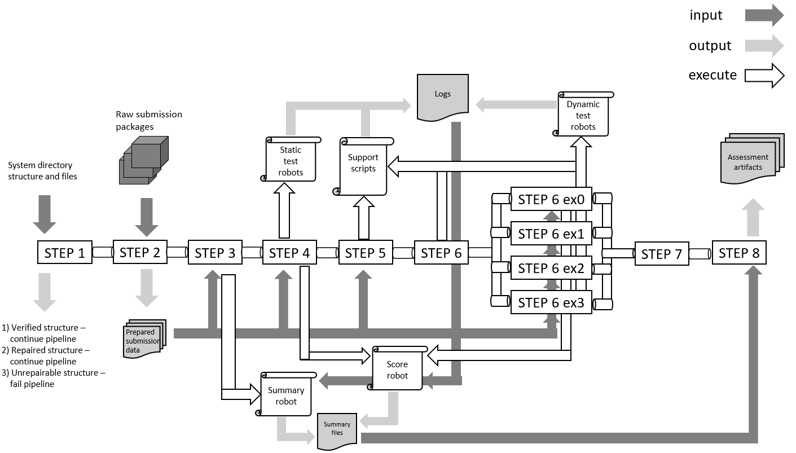
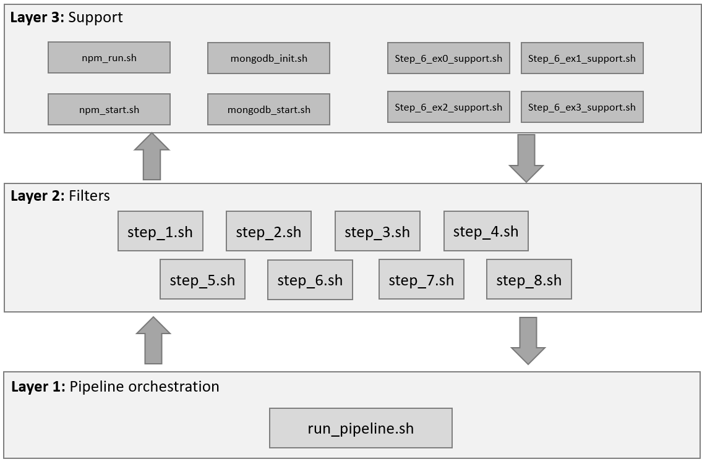

# Automated Assessment System for Web Programming Assignments
This system is a prototype that aims to support in web programming student assignment assessment. The prototype has been developed using a course arranged by the university of Turku, _DTEK2040: Web And Mobile Programming_, as a case study.

The goal of this system is to take student submissions as initial input and then run them through sets of automated tests to assert whether relevant assignment dictated requirements are fulfilled. Implemented robotic process automation tasks are performed to complete various file manipulation and submission preparament, record keeping and summary formulation processes.

System has been built using Bash, Robot Framework and Python.

Shield: [![CC BY 4.0][cc-by-shield]][cc-by]

This work is licensed under a
[Creative Commons Attribution 4.0 International License][cc-by].

[![CC BY 4.0][cc-by-image]][cc-by]

[cc-by]: http://creativecommons.org/licenses/by/4.0/
[cc-by-image]: https://i.creativecommons.org/l/by/4.0/88x31.png
[cc-by-shield]: https://img.shields.io/badge/License-CC%20BY%204.0-lightgrey.svg

## **Contents**
### 1) **Install**: _How the setup was done during development_
### 2) **Use**: _How the prototype was used while testing_
### 3) **Packages** and high level descriptions: _What package versions were used to test_

---

# 1) Install

## Installation foreword
Prototype has been tested with
1) Debian 11 (bullseye)
2) Docker container running on base image python:3-slim-bullseye

Installation instructions will cover the first one and briefly note the second one.
Knowledge of basic OS usage is expected.

---

## Install on Debian
First Python related steps can be skipped if Python3 version >3.9 already installed. The prototype was developed with Python 3.9.2. No guarantees for future versions.
Version can be checked with:

    python3 --version

Otherwise the steps cover how to install all the required packages for the automation tests to work as they should. Dockerfile contents can also be used to execute all the installation commands included in the _RUN_ section (mind the mkdirs and permission mods; these can be skipped). In this case also chrome and chromedriver will be installed. 

**1\) Python dependencies:**

    sudo apt install wget build-essential libreadline-gplv2-dev libncursesw5-dev \
    libssl-dev libsqlite3-dev tk-dev libgdbm-dev libc6-dev libbz2-dev libffi-dev zlib1g-dev

**2\) Python:**

Download the latest / wanted Python release:

    wget https://www.python.org/ftp/python/3.9.2/Python-3.9.2.tgz

Extract and navigate to python dir:

    tar xzf Python-3.9.1.tgz && cd Python-3.9.2

Prepare python source code compilation:

    /configure --enable-optimizations

Build:

    make -j 2

Install binaries:

    sudo make alt install

Python is now installed as an alternative install. Command to use is 'python' appended with the installed version, i.e.

    python3.9 --version

**3\) Node, npm, create-rect-app and json-server:**
(see also: https://github.com/nodesource/distributions/blob/master/README.md)

    curl -fsSL https://deb.nodesource.com/setup_18.x | bash - \
    && apt-get install -y nodejs \
    && npm install npm@latest -g \
    && npm install -g create-react-app \
    && npm install -g json-server

**4\) netcat:**

Netcat:

    apt-get install -y netcat

**5\) Robot Framework + libraries, Beautiful Soup, parsers:**

Robot Framework (+ browser library, requests library, excel library) and
Beautiful Soup (+ html5lib & lxml parsers) are installed using the pip commands inside _requirements.txt_ file.

Inside the prototype root dir, execute command:

    pip3 install -r ./requirements.txt

Initialize browser library:

    rfbrowser init

**6\) Mongo database:**
(see also: https://www.mongodb.com/docs/manual/tutorial/install-mongodb-on-debian/)

Import public key and create list file:

    wget -qO - https://www.mongodb.org/static/pgp/server-6.0.asc | apt-key add - \
    && echo "deb http://repo.mongodb.org/apt/debian buster/mongodb-org/6.0 main" \
    | tee /etc/apt/sources.list.d/mongodb-org-6.0.list

Reload package database and install Mongo db packages:

    && apt-get update \
    && apt-get install -y mongodb-org

Directories for Mongo db data and log files should be created during the installation.
However, if Mongo does not seem to launch at all, consult instructions from the link mentioned at the start of this step.

---

## Install on Docker

The root directory contains _Dockerfile_ which can be used to build a docker image.
Consult Docker documentation on how to use Docker. (For example: https://docs.docker.com/get-started/02_our_app/)

---

# 2) Use

## Set up before running the pipeline
Directories for separate exercises are found in **./data/submissions/** directory. Before executing the pipeline, to-be-assessed submissions should be inside their respective exercise folder packaged in **zip** format.

---

## Executing the pipeline on a local system
Pipeline is started by executing the _run_pipeline.sh_ script located inside **./pipeline_scripts/orchestrating/** directory.

The exercise set to assess is declared with parameter _ex0_ / _ex1_ / _ex2_ / _ex3_, i.e. when executed from root directory:

    ./pipeline_scripts/orchestrating/run_pipeline.sh ex3

---

## Executing the pipeline on Docker
The entrypoint inside Dockerfile needs to be used and the wanted exercise option declared. By default the entrypoint has been commented out, in which case the container needs to be accessed manually to run the pipeline as one would do locally.

---

## Executing the pipeline on GitLab CI
Root directory contains _gitlab-ci.yml_ file which sets up a two stage CI pipeline in GitLab if the prototype is pushed as a repo. The ci-file contains variable _ASSESSMENT_COVERAGE_ which is used to define the exercise set that should be assessed during pipeline execution.

When executed inside the CI, Dockerfile should have the entrypoint line commented out or removed because the ci-file will be responsible for running the script.

Results for the execution are uploaded as artifacts and can be downloaded once run is complete. Make sure to set the CI execution timelimit high enough from GitLab settings, depending on submission batch size to assess.

---

# 3) Packages and high level descriptions

**Prototype has been tested with the following package versions**

| Name  | Version   |
| ---   | --- |
| Node.js | 18.7.0 |
| Npm | 8.18.0 |
| create-react-app | 5.0.1 |
| json-server | 0.17.0 |
| MongoDB | 6.0.1 |
| netcat | 1.217-3 |
| lxml | 4.9.1 |
| html5lib | 1.1 |
| Beautiful Soup | 4.11.1 |
| Robot Framework | 5.0.1 |
| Browser library | 14.1.0 |
| Requests library | 0.9.3 |

---

**Architecture overview**

---

**Script logical layering**

